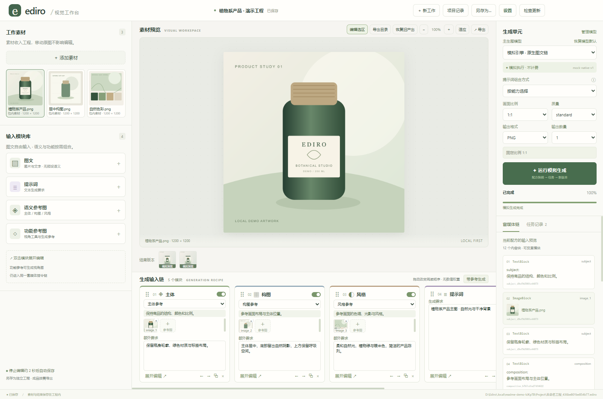
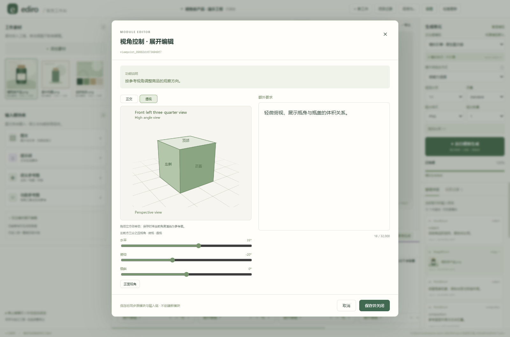
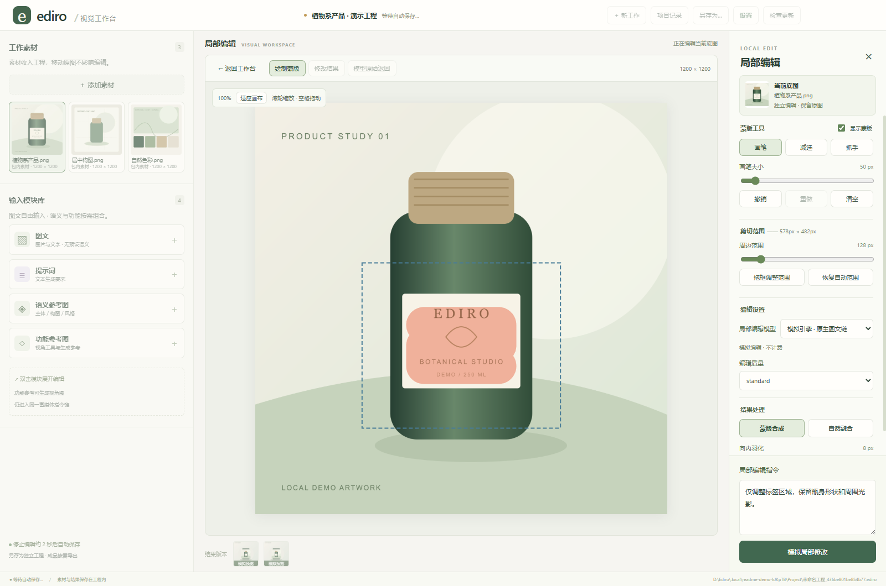

# Ediro · AI Image Workspace

[简体中文](README.md) | **English**

A Windows desktop workspace for e-commerce visuals. Combine product, composition, style, text, and viewpoint references to generate images, make local edits, and manage versions in one project.

Ediro runs independently and does not require Codex or another workspace application. Real generation requires your own model connection and API key. The free simulation engine lets you explore the workflow; it does not demonstrate real model quality.

[Download the latest release](https://github.com/SimonFlipig/Ediro/releases/latest) · [v0.1.0 release notes (Chinese)](docs/RELEASE_NOTES_v0.1.0.md) · [Report an issue](https://github.com/SimonFlipig/Ediro/issues)



*The screenshots use an isolated demo project with locally drawn sample artwork and simulated outputs. They illustrate the interface, not real AI generation quality. The application interface is currently in Chinese; this page provides English documentation.*

## Download and launch

The supported release platform is **Windows x64**. [GitHub Releases](https://github.com/SimonFlipig/Ediro/releases) provides two packages:

- **Installer:** download `Ediro-<version>-windows-x64-setup.exe`, install it, and launch Ediro from the desktop or Start menu. Keep the default per-user installation directory in most cases. To install under `Program Files`, choose the all-users installation option and accept the Windows administrator prompt; changing the directory alone does not grant permission.
- **Portable ZIP:** download `Ediro-<version>-windows-x64-portable.zip`, extract the entire archive into a writable folder, and run `Ediro.exe`. Do not run it from inside the ZIP.

Both packages include the runtime, so end users do not need Node.js. The current packages are unsigned, and Windows may show an unknown-publisher warning. Download from this repository and check the accompanying `SHA256SUMS.txt` file.

## Create your first image

1. Open **设置 (Settings)** and configure your connection, API key, models, and default image-generation model. Model tests and real generation may incur API charges.
2. Start with the empty workspace. Drag images into the window or click **添加素材 (Add assets)**.
3. Add images to the subject, composition, and style modules, then describe your requirements. You can also use free-form image/text, prompt, and viewpoint modules.
4. Choose the model and generation parameters, then run generation. Failed real-model calls are not automatically retried or switched to another provider.
5. Select a historical result to restore its creative settings. Enter local editing when needed, and export the finished result as a regular image.

The release includes the author's selected default module prompts. Results still depend on the model, input images, and your instructions; the same prompts do not guarantee identical results across models.

## Feature screenshots

### Viewpoint references

Adjust orientation, elevation, roll, and projection in the viewpoint tool. Saving adds the reference image and your additional instructions to the creative module.



### Local editing

Paint the area you want to change, describe the edit, and choose natural blending or strict local editing. The original image and result versions remain in the project for further work.



## Save and resume your work

- A self-contained `.ediro` project stores assets, outputs, creative settings, history, and recovery records.
- Launching the app or choosing **新工作 (New work)** opens an empty workspace. The first successful asset import or valid queued generation creates the default project. **另存为 (Save As)** can also save an empty project.
- Edits are saved automatically after about two seconds of inactivity. Press `Ctrl+S` to save immediately. Ediro saves before switching projects or closing normally; if saving fails, it keeps the window open and reports the problem.
- Opening an existing `.ediro` file edits that file in place. **Save As** creates and switches to a separate copy, preserving the original.
- After restarting, use **项目记录 (Project history)** or drag in a `.ediro` file to resume. Ediro does not automatically reopen the last project.
- Exported images are separate from the project. Keep the `.ediro` file to continue editing. Removing a project uses the Recycle Bin and leaves exported images and other projects in place.

A forced shutdown or power loss may lose the latest unsaved edits. Save and close normally before copying a project; do not move it while a save is in progress.

## Where your data lives

| Edition | Default projects and exports | Settings, credentials, and recovery cache |
| --- | --- | --- |
| Installed | `Ediro/Project` and `Ediro/output` under your Windows Documents folder | `%APPDATA%/Ediro/runtime` |
| Portable | `data/Project` and `data/output` beside the executable | `data/.local/runtime` |
| Source / development | `Project` and `output` in the source directory | `.local/runtime` |

Projects opened or saved elsewhere remain at their chosen locations. Before updating the portable edition, close Ediro, preserve the entire `data` folder, and place it beside the new executable. Keep the `ediro-portable.json` mode marker. Uninstalling the installed edition does not intentionally delete your projects or settings.

API keys are encrypted using Windows secure storage and are not included in project files. Reconfigure connections and credentials when moving to another computer or Windows user account. Assets, prompts, and historical requests are project content; review them before sharing a project.

## Current limitations

- Image import supports PNG, JPEG, and WebP. Image counts, dimensions, and other parameters also depend on the chosen model and provider.
- The first release does not register a system-wide `.ediro` file association or support real-time collaboration between processes.
- Large projects require additional disk space for working caches. See the [single-file project documentation (Chinese)](docs/单文件工程_v1.md).
- Local regression and simulation tests do not replace real-model quality tests. You are responsible for real API usage costs.
- The interface is currently in Chinese. First-release acceptance testing was performed on the developer's own computer; other computers and the full upgrade path between published versions have not yet been validated.

## Updates

Release builds periodically check for official GitHub releases after launch. You can also click **检查更新 (Check for updates)** in the top bar. GitHub must be reachable; a failed update check does not prevent you from continuing your work.

- **Installed edition:** choose to download an update, then click **保存并重启升级 (Save and restart to update)** after verification. Installation is blocked while generation, inference, or model tests are running, or while edits are unsaved or a save has failed. Simply closing the application does not install a downloaded update.
- **Portable edition:** Ediro notifies you of a new version and opens its release page. Download and extract the new portable ZIP into a new directory, close the old application, and preserve and transfer your `data` folder.
- Updates preserve projects and settings. An installation under `Program Files` may require another Windows administrator prompt.
- Development builds do not check for updates or replace source files. Updates follow official releases, not ordinary source commits.

Current packages are unsigned. Downloads use HTTPS and are checked against the SHA-512 value in the release metadata; this is not a publisher's digital signature.

## Run and build from source

You need Windows, **Node.js 22.12 or later**, and npm.

```powershell
npm ci
npm run dev
```

To run checks and create Windows packages:

```powershell
npm run check
npm run package:win
```

`check` runs application type checks, tests, and a build. A separate strict type check of the test source is not currently included. `package:win` creates an installer and portable ZIP on Windows x64 without uploading them. See [Windows packaging and data directories (Chinese)](docs/Windows发布与数据目录.md).

The source launchers `Ediro.vbs` and `启动 Ediro.cmd` check the build state before starting the development copy. Install dependencies before first use. Launcher build logs are stored in `.local/launcher/build.log`.

## License

Copyright (C) 2026 Ediro contributors.

Original code and the included default prompts are licensed under **GNU GPL version 3** (`GPL-3.0-only`). See [LICENSE](LICENSE) for the full terms. Use, modification, and commercial use are permitted subject to the license; distributing covered software or modified versions requires compliance with its source-code and licensing obligations. The program is provided without warranty, including warranties of merchantability or fitness for a particular purpose.

Third-party components retain their own copyrights and licenses. See [third-party notices (Chinese)](THIRD_PARTY_NOTICES.md) and the accompanying original license texts.
